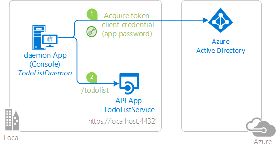
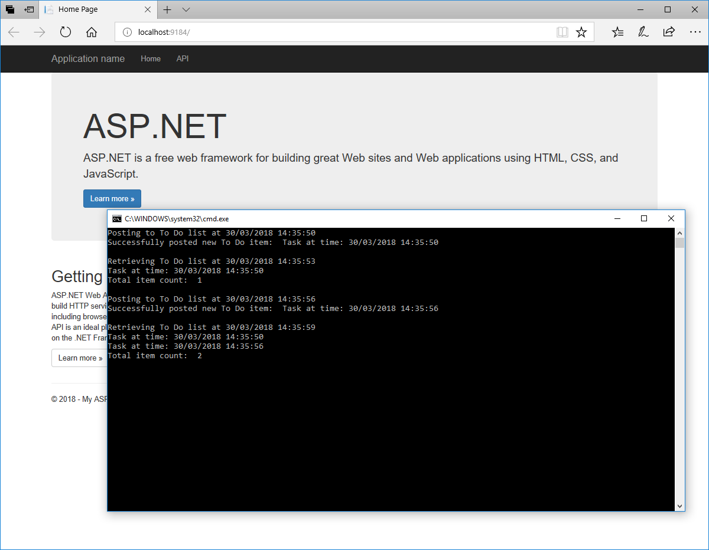

# Calling a Web API in a daemon app or long-running process


## About this sample

### Overview

This sample demonstrates a Desktop daemon application calling a ASP.NET Web API that is secured using Azure Active Directory. This scenario is useful for situations where a headless, or unattended job, or process, needs to run as an application identity, instead of as a user's identity.

1. The .Net `TodoListDaemon` application uses the Active Directory Authentication Library (ADAL) to obtain a JWT access token from Azure Active Directory (Azure AD). The token is requested using the OAuth 2.0 [Client Credentials flow](https://github.com/AzureAD/azure-activedirectory-library-for-dotnet/wiki/Client-credential-flows), where the client credential is a password. You could also use a certificate to prove the identity of the app. Client credential with certificate is the object of another sample: [active-directory-dotnet-daemon-certificate-credential](https://github.com/Azure-Samples/active-directory-dotnet-daemon-certificate-credential) sample.
2. The access token is used as a bearer token to authenticate the user when calling the `TodoListService` ASP.NET Web API.



### Scenario

Once the service started, when you start the `TodoListDaemon` desktop application, it repeatedly:

- adds items to the todo list maintained by the service,
- lists the existing items.

No user interaction is involved.



## How to run this sample

To run this sample, you'll need:

- [Visual Studio 2017](https://aka.ms/vsdownload)
- An Internet connection
- An Azure Active Directory (Azure AD) tenant. For more information on how to get an Azure AD tenant, see [How to get an Azure AD tenant](https://azure.microsoft.com/en-us/documentation/articles/active-directory-howto-tenant/)
- A user account in your Azure AD tenant. This sample will not work with a Microsoft account (formerly Windows Live account). Therefore, if you signed in to the [Azure portal](https://portal.azure.com) with a Microsoft account and have never created a user account in your directory before, you need to do that now.

### Step 1:  Clone or download this repository

From your shell or command line:

`git clone https://github.com/Azure-Samples/active-directory-dotnet-daemon.git`

> Given that the name of the sample is pretty long, and so are the name of the referenced NuGet pacakges, you might want to clone it in a folder close to the root of your hard drive, to avoid file size limitations on Windows.

### Step 2:  Register the sample with your Azure Active Directory tenant

There are two projects in this sample. Each needs to be separately registered in your Azure AD tenant. To register these projects, you can:

- either follow the steps in the paragraphs below ([Step 2](#step-2--register-the-sample-with-your-azure-active-directory-tenant) and [Step 3](#step-3--configure-the-sample-to-use-your-azure-ad-tenant))
- or use PowerShell scripts that:
  - **automatically** create for you the Azure AD applications and related objects (passwords, permissions, dependencies)
  - modify the Visual Studio projects' configuration files.

If you want to use this automation, read the instructions in [App Creation Scripts](./AppCreationScripts/AppCreationScripts.md)

#### First step: choose the Azure AD tenant where you want to create your applications

As a first step you'll need to:

1. Sign in to the [Azure portal](https://portal.azure.com).
1. On the top bar, click on your account, and then on **Switch Directory**.
1. Once the *Directory + subscription* pane opens, choose the Active Directory tenant where you wish to register your application, from the *Favorites* or *All Directories* list.
1. Click on **All services** in the left-hand nav, and choose **Azure Active Directory**.

> In the next steps, you might need the tenant name (or directory name) or the tenant ID (or directory ID). These are presented in the **Properties**
of the Azure Active Directory window respectively as *Name* and *Directory ID*

#### Register the service app (TodoListService Web API)

1. In the  **Azure Active Directory** pane, click on **App registrations** and choose **New application registration**.
1. Enter a friendly name for the application, for example 'TodoListService' and select 'Web app / API' as the *Application Type*.
1. For the *sign-on URL*, enter the base URL for the sample. By default, this sample uses `https://localhost:44321/`.
1. Click **Create** to create the application.
1. In the succeeding page, Find the *Application ID* value and record it for later. You'll need it to configure the Visual Studio configuration file for this project.
1. Then click on **Settings**, and choose **Properties**.
1. For the App ID URI, replace the guid in the generated URI 'https://\<your_tenant_name\>/\<guid\>', with the name of your service, for example, 'https://\<your_tenant_name\>/TodoListService' (replacing `<your_tenant_name>` with the name of your Azure AD tenant).
1. Default value of "User assignment required" property is No for the newly created apps which allows any client app in the same tenant to validate against the service without assigning a permission explicitly. To prevent this, [set "User assignment required" property to Yes](https://github.com/MicrosoftDocs/azure-docs/blob/master/articles/active-directory/active-directory-applications-guiding-developers-requiring-user-assignment.md) and please create an application role in the service app manifest as below-
```
"appRoles": [
    {
      "allowedMemberTypes": [
        "Application"
      ],
      "displayName": "TodoListAdmin",
      "id": "<Guid>",
      "isEnabled": true,
      "description": "Administrators can manage the todo list in their tenant",
      "value": "TodoListAdmin"
    }
  ]
  ```
Please replace `<Guid>` in the above manifest with a unique GUID in the following format 00000000-0000-0000-0000-000000000000 and save the manifest. We are creating an **Application** type role here for the daemon service.

#### Register the client app (TodoListDaemon)

1. In the  **Azure Active Directory** pane, click on **App registrations** and choose **New application registration**.
1. Enter a friendly name for the application, for example 'TodoListDaemon' and select 'Web app / API' as the *Application Type*.
   > Even if this is a desktop application, this is a confidential client application hence the Application Type being 'Web app / API', which is counter intuitive
1. For the *Sign-on URL*, enter `https://<your_tenant_name>/TodoListDaemon`, replacing `<your_tenant_name>` with the name of your Azure AD tenant.
1. Click **Create** to create the application.
1. In the succeeding page, Find the *Application ID* value and record it for later. You'll need it to configure the Visual Studio configuration file for this project.
1. Then click on **Settings**, and choose **Properties**.
1. For the App ID URI, replace the guid in the generated URI 'https://\<your_tenant_name\>/\<guid\>', with the name of your service, for example, 'https://\<your_tenant_name\>/TodoListDaemon' (replacing `<your_tenant_name>` with the name of your Azure AD tenant)
1. From the Settings menu, choose **Keys** and add a new entry in the Password section:

   - Type a key description (of instance `app secret`),
   - Select a key duration of either **In 1 year**, **In 2 years**, or **Never Expires**.
   - When you save this page, the key value will be displayed, copy, and save the value in a safe location.
   - You'll need this key later to configure the project in Visual Studio. This key value will not be displayed again, nor retrievable by any other means,
     so record it as soon as it is visible from the Azure portal.
1. Configure Permissions for your application. To that extent, in the Settings menu, choose the 'Required permissions' section and then,
   click on **Add**, then **Select an API**, and type `TodoListService` in the textbox. Then, click on  **Select Permissions** and select **'TodoListAdmin'**. This will allow this client app to access the service app using TodoListAdmin role.
1. At this stage permissions are assigned correctly but client app is a daemon service so it cannot accept the consent via UI to use the service app. To avoid this situation, please click on "Grant permissions" which will accept the consent for the app at the admin level.

### Step 3:  Configure the sample to use your Azure AD tenant

In the steps below, "ClientID" is the same as "Application ID" or "AppId".

Open the solution in Visual Studio to configure the projects

#### Configure the service project

1. Open the `TodoListService\Web.Config` file
1. Find the app key `ida:Tenant` and replace the existing value with your Azure AD tenant name.
1. Find the app key `ida:Audience` and replace the existing value with the App ID URI you registered earlier for the TodoListService app. For instance use `https://<your_tenant_name>/TodoListService`, where `<your_tenant_name>` is the name of your Azure AD tenant.

#### Configure the client project

1. Open the `TodoListDaemon\App.Config` file
1. Find the app key `ida:Tenant` and replace the existing value with your Azure AD tenant name.
1. Find the app key `ida:ClientId` and replace the existing value with the application ID (clientId) of the `TodoListDaemon` application copied from the Azure portal.
1. Find the app key `ida:AppKey` and replace the existing value with the key you saved during the creation of the `TodoListDaemon` app, in the Azure portal.
1. Find the app key `todo:TodoListResourceId` and replace the existing value with the App ID URI you registered earlier for the TodoListService app. For instance use `https://<your_tenant_name>/TodoListService`, where `<your_tenant_name>` is the name of your Azure AD tenant.
1. Find the app key `todo:TodoListBaseAddress` and replace the existing value with the base address of the TodoListService project (by default `https://localhost:44321/`).

**NOTE:** The TodoListService's `ida:Audience` and TodoListDaemon's `todo:TodoListResourceId` app key values must not only match the App ID URI you configured, but they must also match each other exactly. This mach includes casing. Otherwise calls to the TodoListService /api/todolist endpoint will fail with "Error: unauthorized".

### Step 4: Run the sample

Clean the solution, rebuild the solution, and run it.  You might want to go into the solution properties and set both projects as startup projects, with the service project starting first.

See the scenario section above to understand how to run the sample

## How to deploy this sample to Azure

This project has one WebApp / Web API projects. To deploy them to Azure Web Sites, you'll need, for each one, to:

- create an Azure Web Site
- publish the Web App / Web APIs to the web site, and
- update its client(s) to call the web site instead of IIS Express.

### Create and Publish the `TodoListService` to an Azure Web Site

1. Sign in to the [Azure portal](https://portal.azure.com).
2. Click **Create a resource** in the top left-hand corner, select **Web + Mobile** --> **Web App**, select the hosting plan and region, and give your web site a name, for example, `TodoListService-contoso.azurewebsites.net`.  Click Create Web Site.
3. Once the web site is created, click on it to manage it.  For this set of steps, download the publish profile by clicking **Get publish profile** and save it.  Other deployment mechanisms, such as from source control, can also be used.
4. Switch to Visual Studio and go to the TodoListService project.  Right click on the project in the Solution Explorer and select **Publish**.  Click **Import Profile** on the bottom bar, and import the publish profile that you downloaded earlier.
5. Click on **Settings** and in the `Connection tab`, update the Destination URL so that it is https, for example [https://TodoListService-contoso.azurewebsites.net](https://TodoListService-contoso.azurewebsites.net). Click Next.
6. On the Settings tab, make sure `Enable Organizational Authentication` is NOT selected.  Click **Save**. Click on **Publish** on the main screen.
7. Visual Studio will publish the project and automatically open a browser to the URL of the project.  If you see the default web page of the project, the publication was successful.

### Update the Active Directory tenant application registration for `TodoListService`

1. Navigate to the [Azure portal](https://portal.azure.com).
2. On the top bar, click on your account and under the **Directory** list, choose the Active Directory tenant containing the `TodoListService` application.
3. On the applications tab, select the `TodoListService` application.
4. From the Settings -> Reply URLs menu, update the Sign-On URL, and Reply URL fields to the address of your service, for example [https://TodoListService-contoso.azurewebsites.net](https://TodoListService-contoso.azurewebsites.net). Save the configuration.

### Update the `TodoListDaemon` to call the `TodoListService` Running in Azure Web Sites

1. In Visual Studio, go to the `TodoListDaemon` project.
2. Open `TodoListDaemon\App.Config`.  Only one change is needed - update the `todo:TodoListBaseAddress` key value to be the address of the website you published,
   for example, [https://TodoListService-contoso.azurewebsites.net](https://TodoListService-contoso.azurewebsites.net).
3. Run the client! If you are trying multiple different client types (for example, .Net, Windows Store, Android, iOS) you can have them all call this one published web API.

> NOTE: Remember, the To Do list is stored in memory in this TodoListService sample. Azure Web Sites will spin down your web site if it is inactive, and your To Do list will get emptied.
Also, if you increase the instance count of the web site, requests will be distributed among the instances. To Do will, therefore, not be the same on each instance.

## About The Code

The code acquiring a token is located entirely in the `TodoListDaemon\Program.cs` file.
The `Authentication` context is created (line 68)

```CSharp
authContext = new AuthenticationContext(authority);
```

Then a `ClientCredential` is instantiated (line 69), from the TodoListDaemon application's Client ID and the application secret (`appKey`).

```CSharp
clientCredential = new ClientCredential(clientId, appKey);
```

This instance of `ClientCredential` is used in the `PostTodo()` and `GetTodo()` methods  as an argument to `AcquireTokenAsync` to get a token for the Web API (line 96 and 162)

```CSharp
result = await authContext.AcquireTokenAsync(todoListResourceId, clientCredential);
```

This token is then used as a bearer token to call the Web API (line 127 and 193)

```CSharp
httpClient.DefaultRequestHeaders.Authorization = new AuthenticationHeaderValue("Bearer", result.AccessToken)
```

## How to recreate this sample

First, in Visual Studio create an empty solution to host the  projects.  Then, follow the following steps to create each project.

### Creating the TodoListService Project

1. In the solution, create a new ASP.Net MVC web API project called `TodoListService` and while creating the project:

   - Click the **Change Authentication** button,
   - Select **Organizational Accounts, Cloud - Single Organization**,
   - Enter the name of your Azure AD tenant,
   - and set the Access Level to **Single Sign On**. You will be prompted to sign in to your Azure AD tenant.

     > NOTE:  You must sign in with a user that is in the tenant; you cannot, during this step, sign in with a Microsoft account.

2. In the  folder, add a new class called `TodoItem.cs`.  Copy the implementation of TodoItem from this sample into the class.
3. Add a new, empty, Web API 2 controller called `TodoListController`.
4. Copy the implementation of the TodoListController from this sample into the controller.  Don't forget to add the `[Authorize]` attribute to the class.
5. In `TodoListController` resolving missing references by adding `using` statements for `System.Collections.Concurrent`, `TodoListService.Models`, `System.Security.Claims`.

### Creating the TodoListDaemon Project

1. In the solution, create a new Windows --> Console Application called TodoListDaemon.
2. Add the (stable) Active Directory Authentication Library (ADAL) NuGet, Microsoft.IdentityModel.Clients.ActiveDirectory, version 1.0.3 (or higher) to the project.
3. Add  assembly references to `System.Net.Http`, `System.Web.Extensions`, and `System.Configuration`.
4. Add a new class to the project called `TodoItem.cs`.  Copy the code from the sample project file of the same name into this class, completely replacing the code in the new file.
5. Copy the code from `Program.cs` in the sample project into the file of the same name in the new project, completely replacing the code in the new file.
6. In `app.config` create keys for `ida:AADInstance`, `ida:Tenant`, `ida:ClientId`, `ida:AppKey`, `todo:TodoListResourceId`, and `todo:TodoListBaseAddress` and set them accordingly.  For the global Azure cloud, the value of `ida:AADInstance` is `https://login.windows.net/{0}`.

Finally, in the properties of the solution itself, set both projects as startup projects.

## Community Help and Support

Use [Stack Overflow](http://stackoverflow.com/questions/tagged/adal) to get support from the community.
Ask your questions on Stack Overflow first and browse existing issues to see if someone has asked your question before.
Make sure that your questions or comments are tagged with [`adal` `dotnet`].

If you find a bug in the sample, please raise the issue on [GitHub Issues](../../issues).

To provide a recommendation, visit the following [User Voice page](https://feedback.azure.com/forums/169401-azure-active-directory).

## Contributing

If you'd like to contribute to this sample, see [CONTRIBUTING.MD](/CONTRIBUTING.md).

This project has adopted the [Microsoft Open Source Code of Conduct](https://opensource.microsoft.com/codeofconduct/). For more information, see the [Code of Conduct FAQ](https://opensource.microsoft.com/codeofconduct/faq/) or contact [opencode@microsoft.com](mailto:opencode@microsoft.com) with any additional questions or comments.

## More information

For more information, see ADAL.NET's conceptual documentation:

- [Client credential flows](https://github.com/AzureAD/azure-activedirectory-library-for-dotnet/wiki/Client-credential-flows)
- [Using the acquired token to call a protected Web API](https://github.com/AzureAD/azure-activedirectory-library-for-dotnet/wiki/Using-the-acquired-token-to-call-a-protected-Web-API)

For more information about how OAuth 2.0 protocols work in this scenario and other scenarios, see [Authentication Scenarios for Azure AD](http://go.microsoft.com/fwlink/?LinkId=394414).
